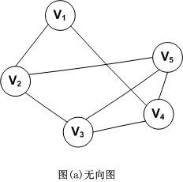
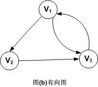
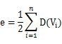
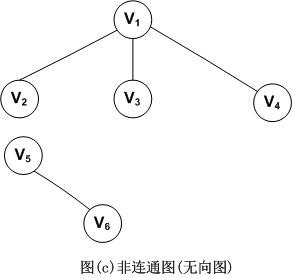
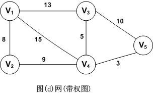
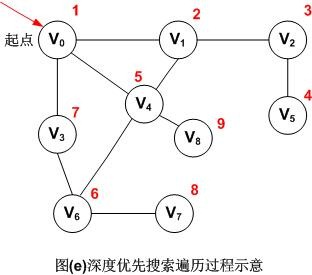
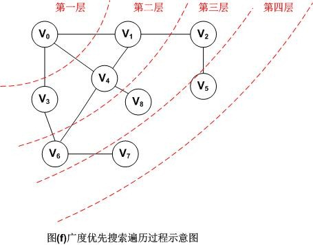
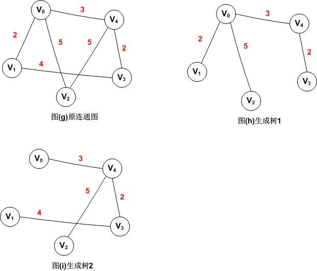
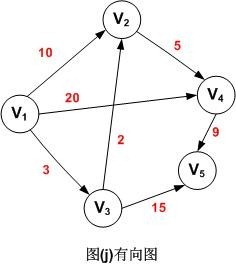

# 图论

### 图的定义
图是一种复杂的非线性结构。

在线性结构中，数据元素之间满足唯一的线性关系，每个数据元素(除第一个和最后一个外)只有一个直接前趋和一个直接后继；

在树形结构中，数据元素之间有着明显的层次关系，并且每个数据元素只与上一层中的一个元素(parent node)及下一层的多个元素(孩子节点)相关；

而在图形结构中，节点之间的关系是任意的，图中任意两个数据元素之间都有可能相关。

图G由两个集合V(顶点Vertex)和E(边Edge)组成，定义为G=(V，E)  

### 图相关的概念和术语
#### 1. 无向图和有向图
对于一个图，若每条边都是没有方向的，则称该图为无向图。图示如下：

因此，(Vi，Vj)和(Vj，Vi)表示的是同一条边。注意，无向图是用小括号，而下面介绍的有向图是用尖括号。

无向图的顶点集和边集分别表示为：

V(G)={V1，V2，V3，V4，V5}

E(G)={(V1，V2)，(V1，V4)，(V2，V3)，(V2，V5)，(V3，V4)，(V3，V5)，(V4，V5)}

 

对于一个图G，若每条边都是有方向的，则称该图为有向图。图示如下。

因此，<Vi，Vj>和<Vj，Vi>是两条不同的有向边。注意，有向边又称为弧。

有向图的顶点集和边集分别表示为：

V(G)={V1，V2，V3}

E(G)={<V1，V2>，<V2，V3>，<V3，V1>，<V1，V3>} 
#### 2. 无向完全图和有向完全图
我们将具有n(n-1)/2条边的无向图称为无向完全图。同理，将具有n(n-1)条边的有向图称为有向完全图
#### 3. 顶点的度
对于无向图，顶点的度表示以该顶点作为一个端点的边的数目。比如，图(a)无向图中顶点V3的度D(V3)=3

对于有向图，顶点的度分为入度和出度。入度表示以该顶点为终点的入边数目，出度是以该顶点为起点的出边数目，该顶点的度等于其入度和出度之和。比如，顶点V1的入度ID(V1)=1，出度OD(V1)=2，所以D(V1)=ID(V1)+OD(V1)=1+2=3

记住，不管是无向图还是有向图，顶点数n，边数e和顶点的度数有如下关系：

因此，就拿有向图(b)来举例，由公式可以得到图G的边数e=(D(V1)+D(V2)+D(V3))/2=(3+2+3)/2=4
#### 4. 路径，路径长度和回路
路径，比如在无向图G中，存在一个顶点序列Vp,Vi1,Vi2,Vi3…，Vim，Vq，使得(Vp,Vi1)，(Vi1,Vi2)，…,(Vim,Vq)均属于边集E(G)，则称顶点Vp到Vq存在一条路径。

路径长度，是指一条路径上经过的边的数量。

回路，指一条路径的起点和终点为同一个顶点。
#### 5. 连通图(无向图)
连通图是指图G中任意两个顶点Vi和Vj都连通，则称为连通图。比如图(b)就是连通图。下面是一个非连通图的例子。

上图中，因为V5和V6是单独的，所以是非连通图。
#### 6. 强连通图(有向图)
强连通图是对于有向图而言的，与无向图的连通图类似。
#### 7. 网
带”权值”的连通图称为网。如图所示。

### 图的创建和遍历
#### 1. 图的两种存储结构
(1) 邻接矩阵，原理就是用两个数组，一个数组保存顶点集，一个数组保存边集。下面的算法实现里边我们也是采用这种存储结构。  
(2) 邻接表，邻接表是图的一种链式存储结构。这种存储结构类似于树的孩子链表。对于图G中每个顶点Vi，把所有邻接于Vi的顶点Vj链成一个单链表，这个单链表称为顶点Vi的邻接表。
#### 2. 图的两种遍历方法
(1) 深度优先搜索遍历

深度优先搜索DFS遍历类似于树的前序遍历。其基本思路是：

(a) 假设初始状态是图中所有顶点都未曾访问过，则可从图G中任意一顶点v为初始出发点，首先访问出发点v，并将其标记为已访问过。

(b) 然后依次从v出发搜索v的每个邻接点w，若w未曾访问过，则以w作为新的出发点出发，继续进行深度优先遍历，直到图中所有和v有路径相通的顶点都被访问到。

(c) 若此时图中仍有顶点未被访问，则另选一个未曾访问的顶点作为起点，重复上述步骤，直到图中所有顶点都被访问到为止。

图示如下：

注：红色数字代表遍历的先后顺序，所以图(e)无向图的深度优先遍历的顶点访问序列为：V0，V1，V2，V5，V4，V6，V3，V7，V8

如果采用邻接矩阵存储，则时间复杂度为O(n^2)；当采用邻接表时时间复杂度为O(n+e)。  

(2)广度优先搜索遍历
   
广度优先搜索遍历BFS类似于树的按层次遍历。其基本思路是：

(a) 首先访问出发点Vi

(b) 接着依次访问Vi的所有未被访问过的邻接点Vi1，Vi2，Vi3，…，Vit并均标记为已访问过。

(c) 然后再按照Vi1，Vi2，… ，Vit的次序，访问每一个顶点的所有未曾访问过的顶点并均标记为已访问过，依此类推，直到图中所有和初始出发点Vi有路径相通的顶点都被访问过为止。

图示如下：

因此，图(f)采用广义优先搜索遍历以V0为出发点的顶点序列为：V0，V1，V3，V4，V2，V6，V8，V5，V7

如果采用邻接矩阵存储，则时间复杂度为O(n^2)，若采用邻接表，则时间复杂度为O(n+e)。

### 最小生成树和最短路径
#### 1. 最小生成树
什么是最小生成树呢？在弄清什么是最小生成树之前，我们需要弄清什么是生成树？

用一句语简单概括生成树就是：生成树是将图中所有顶点以最少的边连通的子图。

比如图(g)可以同时得到两个生成树图(h)和图(i)

知道了什么是生成树之后，我们就很容易理解什么是最小生成树了。所谓最小生成树，用一句话总结就是：权值和最小的生成树就是最小生成树。

比如上图中的两个生成树，生成树1和生成树2，生成树1的权值和为：12，生成树2的权值为：14，我们可以证明图(h)生成树1就是图(g)的最小生成树。

那么如何构造最小生成树呢？可以使用普里姆算法。

#### 2. 最短路径
求最短路径也就是求最短路径长度。下面是一个带权值的有向图，表格中分别列出了顶点V1其它各顶点的最短路径长度。

|源点|最短路径|终点|路径长度|
|  ----  | ----  | ----  | ----  |
|V1|V1，V3，V2|V2|中转5|
|V1|V1，V3|V3|直达3|
|V1|V1，V3，V2，V4|V4|中转10|
|V1|V1，V3，V5|V5|中转18|
表：顶点V1到其它各顶点的最短路径表

从图中可以看出，顶点V1到V4的路径有3条(V1，V2，V4)，(V1，V4)，(V1，V3，V2，V4)，其路径长度分别为15，20和10，因此，V1到V4的最短路径为(V1，V3，V2，V4)。

那么如何求带权有向图的最短路径长度呢？可以使用迪杰斯特拉(Dijkstra)算法。